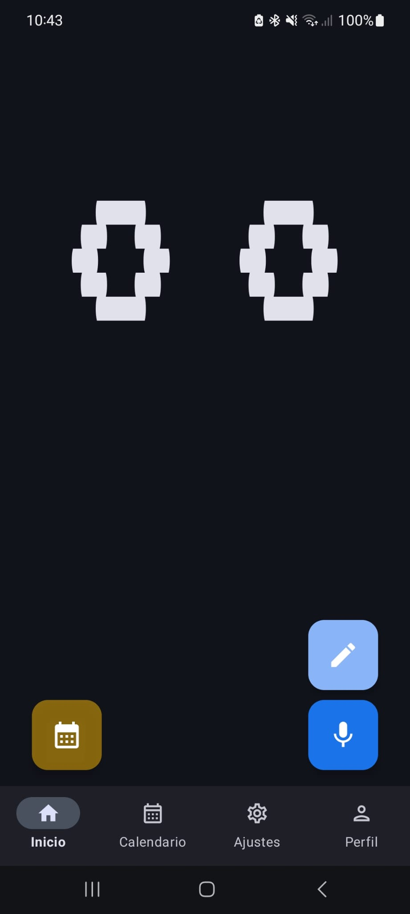
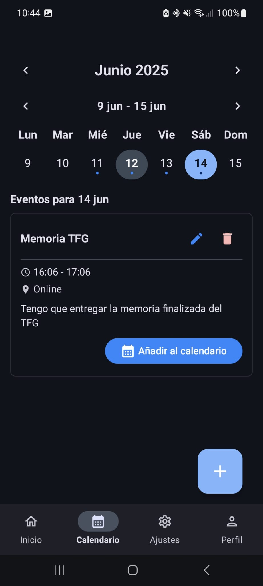
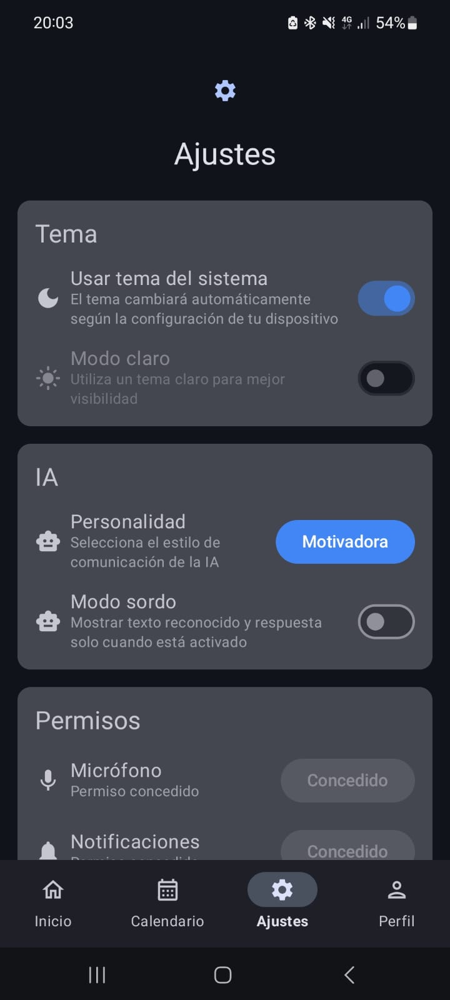
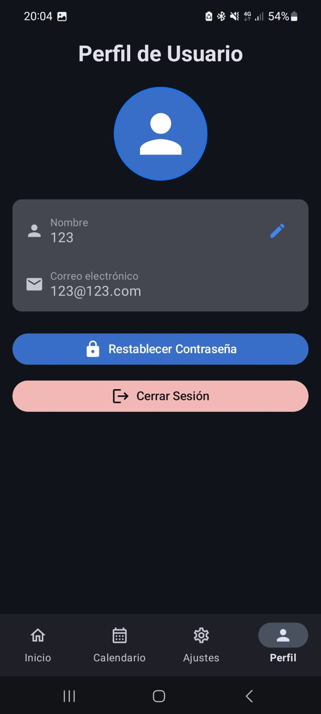

# Blinky


Blinky is an AI assistant app with a unique visual interface inspired by Wrench from Watch Dogs 2. The app displays emotions through animated "eyes" and provides a fun, interactive way to manage your calendar, get information, and more.

## Features

- **Expressive Visual Interface**: Blinky communicates emotions through animated eyes, inspired by the Wrench character from Watch Dogs 2
- **Voice Recognition**: Speak to Blinky and get responses through text-to-speech
- **Text Input**: Type your queries when voice isn't appropriate
- **Calendar Management**: Create and manage events through natural language
- **Home Screen Widget**: Add Blinky's eyes to your home screen with emotions that change automatically
- **Deaf Mode**: Option for users who prefer text-based interaction
- **AI-Powered Responses**: Uses Ollama for intelligent responses to your queries

## Screenshots






## Installation

1. Clone this repository
2. Open the project in Android Studio
3. Build and run the app on your device or emulator

### Requirements

- Android 7.0 (API level 24) or higher
- Internet connection for AI responses

## Usage

### Main Screen

The main screen displays Blinky's eyes, which animate to show different emotions based on your interactions. The eyes take up the top half of the screen.

### Interacting with Blinky

- **Voice Input**: Tap the microphone button to speak to Blinky
- **Text Input**: Tap the edit button to type your message
- **Calendar Events**: Toggle the calendar button to enter event creation mode, then use voice or text to create events

### Widget

Add Blinky's eyes to your home screen:
1. Long press on your home screen
2. Select "Widgets"
3. Find and add the Blinky widget

The widget will cycle through different emotions automatically every 10 seconds and can be tapped to open the app.

## Technologies Used

- **Kotlin**: Primary programming language
- **Jetpack Compose**: Modern UI toolkit for building native UI
- **Material Design 3**: For a clean, modern interface
- **Ollama**: AI model for natural language processing
- **Retrofit**: For network requests
- **ThreeTenABP**: For date and time handling
- **Android Widget API**: For the home screen widget

## Development

### Project Structure

- `app/src/main/java/dam/tfg/blinky/`: Main source code
  - `api/`: API client and services
  - `dataclass/`: Data models including WrenchEmotion
  - `presentation/`: UI components and screens
  - `widget/`: Home screen widget implementation

### Building

The project uses Gradle for building. You can build the project using:

```bash
./gradlew build
```

## Credits

- Inspired by the Wrench character from Watch Dogs 2
- Developed as a final project (TFG - Trabajo Fin de Grado)

## Contributing

Contributions are welcome! Please feel free to submit a Pull Request.